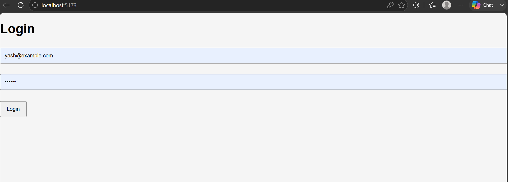
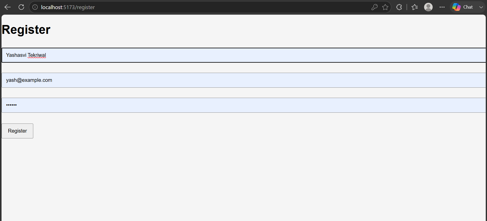
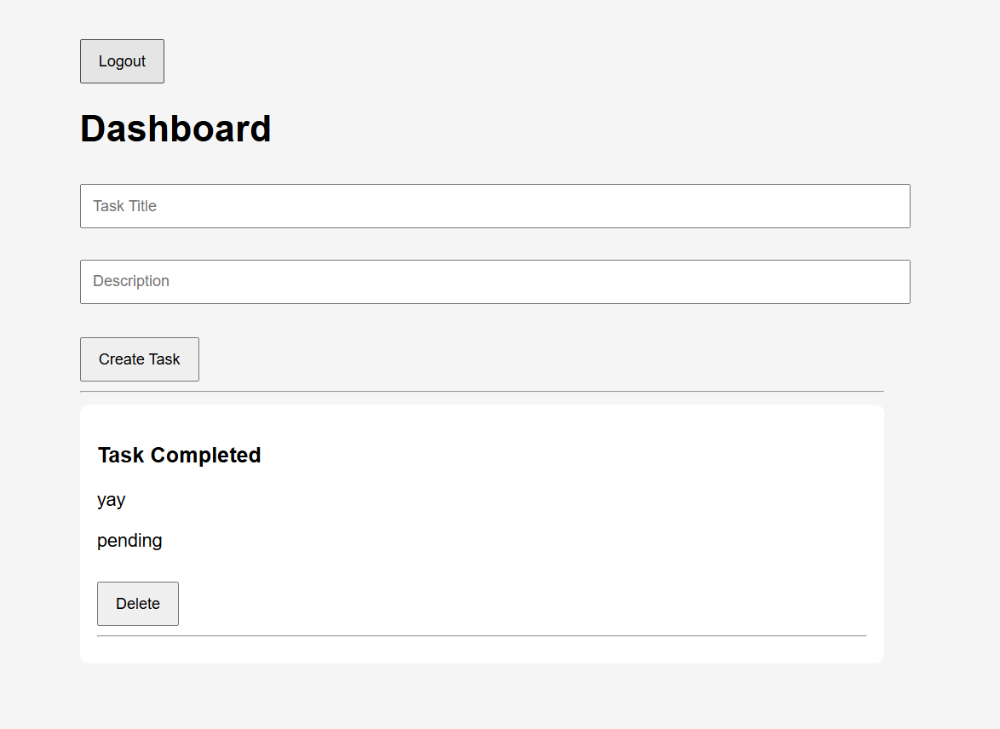

# Task Manager – Full Stack Assignment

A full-stack task management application built using **React**, **Node.js**, **Express**, and **MongoDB**. The application implements secure authentication, role-based authorization, protected routes, and task management functionality through a RESTful API.

## Screenshots

### Login Page



### Register Page



### Dashboard



## Features

### Authentication & Security

* User Registration
* User Login
* Password Hashing using bcryptjs
* JWT Authentication
* Protected Routes
* Input Validation

### Authorization

* Role-Based Access Control (User/Admin)
* Ownership-Based Task Access
* Admin-Only Route Protection

### Task Management

* Create Tasks
* View Tasks
* Delete Tasks
* Secure Task Ownership Verification

### Frontend

* React-based User Interface
* Login & Registration Forms
* Protected Dashboard
* Create and Manage Tasks
* Logout Functionality

---

## Tech Stack

### Frontend

* React
* React Router DOM
* Axios
* Vite

### Backend

* Node.js
* Express.js
* MongoDB
* Mongoose
* JWT (JSON Web Tokens)
* bcryptjs
* express-validator

---

## Project Structure

```text
task-manager
│
├── backend
│   ├── src
│   │   ├── config
│   │   ├── controllers
│   │   ├── middleware
│   │   ├── models
│   │   ├── routes
│   │   └── validators
│   └── server.js
│
├── frontend
│   ├── src
│   │   ├── pages
│   │   ├── services
│   │   └── App.jsx
│
├── docs
│   └── API_ENDPOINTS.md
│
└── README.md
```

---

## API Endpoints

### Authentication

| Method | Endpoint                |
| ------ | ----------------------- |
| POST   | `/api/v1/auth/register` |
| POST   | `/api/v1/auth/login`    |

### Tasks

| Method | Endpoint            |
| ------ | ------------------- |
| GET    | `/api/v1/tasks`     |
| POST   | `/api/v1/tasks`     |
| PUT    | `/api/v1/tasks/:id` |
| DELETE | `/api/v1/tasks/:id` |

### Admin

| Method | Endpoint              |
| ------ | --------------------- |
| GET    | `/api/v1/admin/users` |

---

## Security Features

* JWT-Based Authentication
* Password Hashing with bcryptjs
* Protected API Routes
* Role-Based Authorization
* Request Validation
* Ownership Verification for Resources

---

## Installation

### Backend Setup

```bash
cd backend
npm install
npm run dev
```

Create a `.env` file:

```env
PORT=5000
MONGO_URI=your_mongodb_uri
JWT_SECRET=your_secret_key
```

### Frontend Setup

```bash
cd frontend
npm install
npm run dev
```

Frontend: `http://localhost:5173`

Backend: `http://localhost:5000`

---

## Future Improvements

* Swagger API Documentation
* Docker Deployment
* Redis Caching
* Task Status Updates
* Unit & Integration Testing

---

## Author

**Yashasvi Tekriwal**
Delhi Technological University (DTU)
Electrical Engineering
